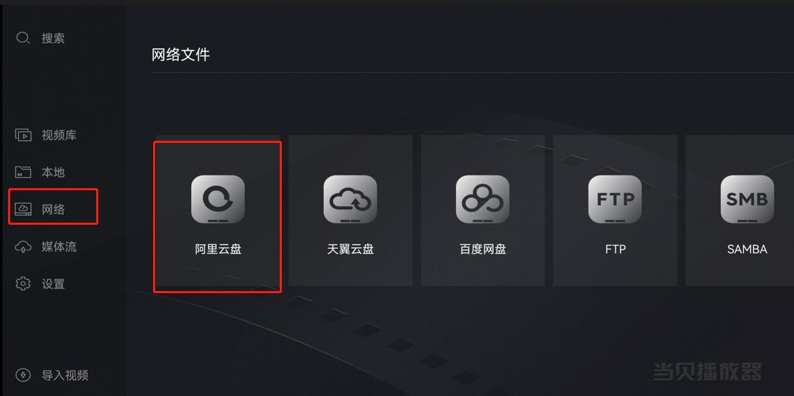

# 前言
现在各大影视资源聚合平台看视频基本上都需要开会员，每个月花个十几二十块的是没什么，但总感觉不舒服，特别是电视或者投影仪上看个电影还要开二次会员。

现在有比较好的观影方式，使用云盘，本篇以阿里云盘为例来说明，其他云盘类似。

`Android` 手机、投影仪、电视建议使用当贝播放器，使用云盘自带播放器会限制播放清晰度，要开会员，使用当贝播放器不会限制其速率。

苹果用户暂时除了官方应用，没发现其他应用。

# 下载地址
- [阿里云盘官网](https://www.aliyundrive.com/download)
- [当贝播放器官网](https://www.dangbei.com/player/)

# 具体使用
1. 打开资源搜索网站，搜索相应的资源，一个资源站搜不到，可以换其他的。这里提供几个资源网站：
| 网站 | 地址 |
| -- | -- |
| 找资源 | [https://www.zhaoziyuan.pw](https://www.zhaoziyuan.pw) |
| 易搜 | [https://yiso.fun](https://yiso.fun) | 
| 奇妙搜索 | [https://www.magicalsearch.top](https://www.magicalsearch.top) | 
| 云盘分享社 | [https://www.yunpanfenxiang.cn](https://www.yunpanfenxiang.cn) |
| YaPan | [https://pan.ccof.cc/](https://pan.ccof.cc/) |
| 凌风云 | [https://www.lingfengyun.com/](https://www.lingfengyun.com/) |
| UP云搜 | [https://www.upyunso.com/](https://www.upyunso.com/) |

2. 保存到自己的云盘（没有账号需先注册），**注意：这里保存到自己的网盘并不是下载到自己的手机上了，看视频的时候还是要有网络的**。

3. 通过官方APP直接播放资源，若是使用的当贝播放器，需要选中网络，登录下云盘。
