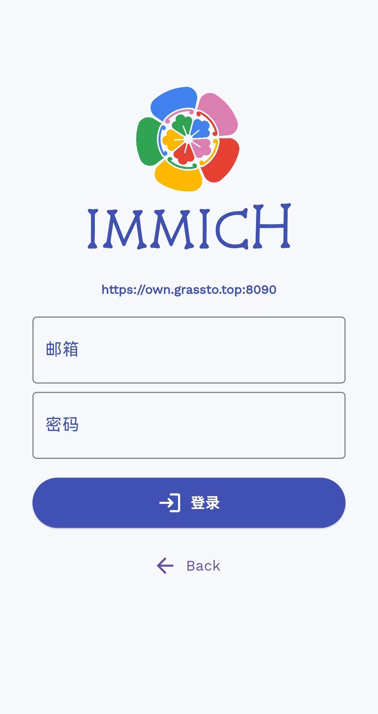
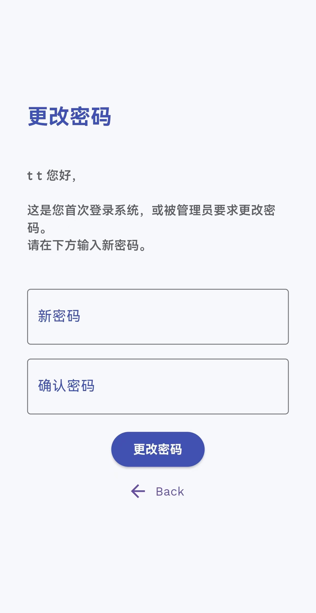
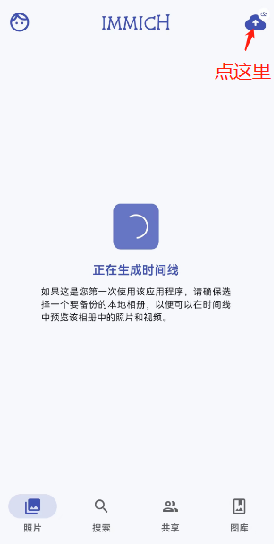
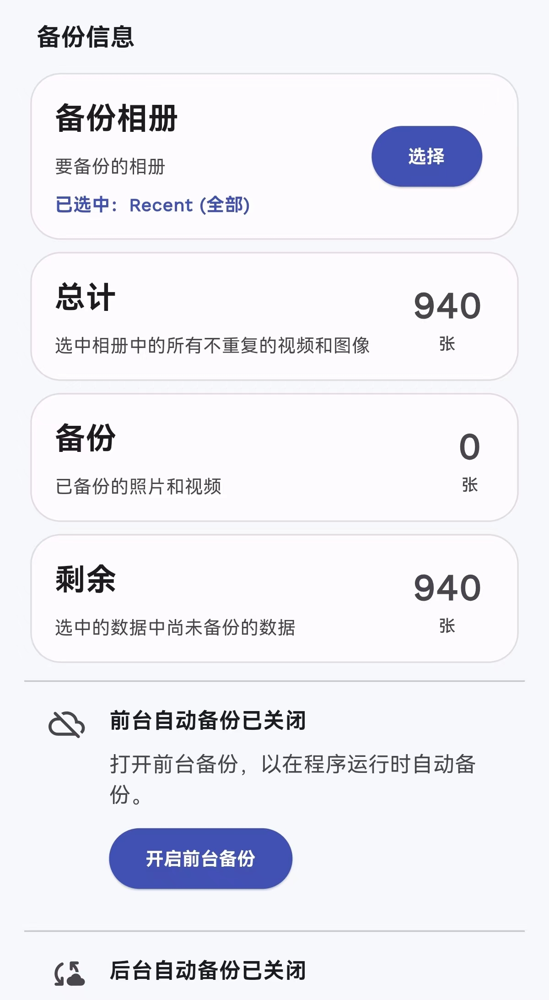
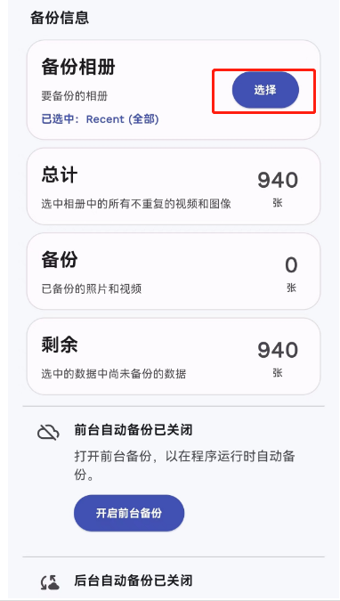
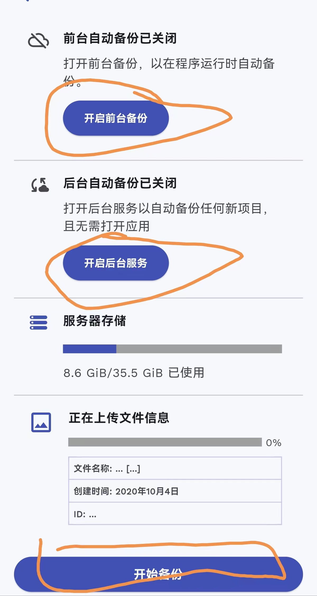

# 下载
- `Android` [下载地址1](https://own.grassto.top:8092/immich.apk)  [下载地址2](https://github.com/immich-app/immich/releases/download/v1.77.0/app-release.apk)

- `iOS` 应用商店搜索 `immich` 安装即可。

图标长这样，别下错了

# 前言
提供一个照片备份的工具，是我自己搭建的服务，个人自己的照片，需要分享之后其他人才能看到，不用担心图片泄露。

服务使用的是开源库 [immich GitHub](https://github.com/immich-app/immich)。

# 使用
1. 下载好应用，打开后第一步需要填写服务器地址 `https://own.grassto.top:8090`

2. 点击进入下一个后，需要输入用户名密码，需要使用的可以直接来跟我要用户名密码

3. 首次登录成功需要更改用户名密码

4. 使用修改后的密码登录，可以看到如下界面，如果图片比较多，需要等一会

5. 点击右上角的上传按钮，可以看到备份页面如下

6. 首先需要选择需要备份的相册（正常情况下这个默认会选择 Recent 相册），不会操作可以跳过此步

7. 往下拉可以看到如下几个按钮，可以将“前台备份”，“后台服务” 都勾选上（若是都不勾选，每次都要手动点击最下方的 “开始备份”），然后点击最下方的 “开始备份”。

- 开启前台备份：程序打开时才进行备份。
- 开启后台服务：程序后台运行时也进行备份。
- 开始备份：需要手动点击一次，才会进行数据传输。

应用的功能还有很多，感兴趣的自行去探索。

# 开源库
[immich GitHub](https://github.com/immich-app/immich)
